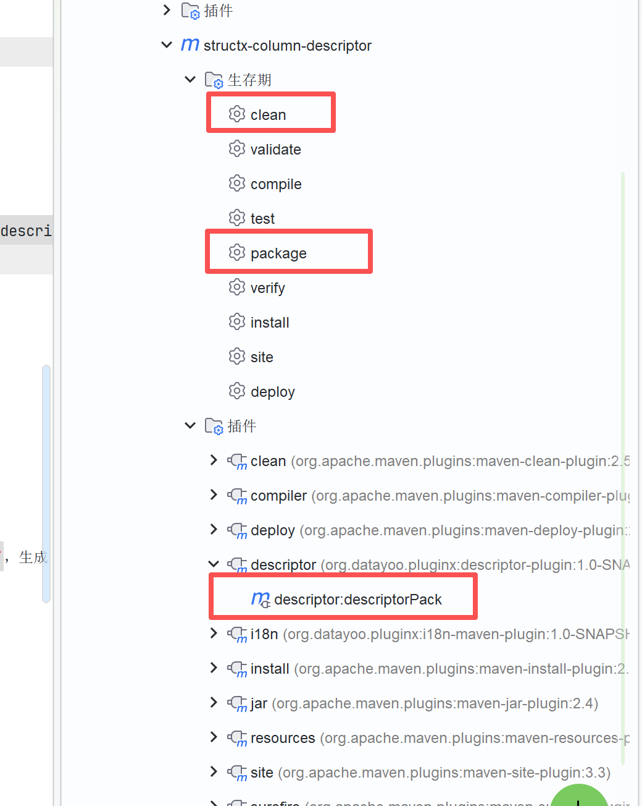
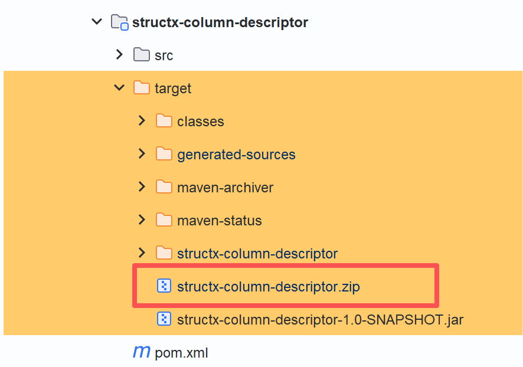
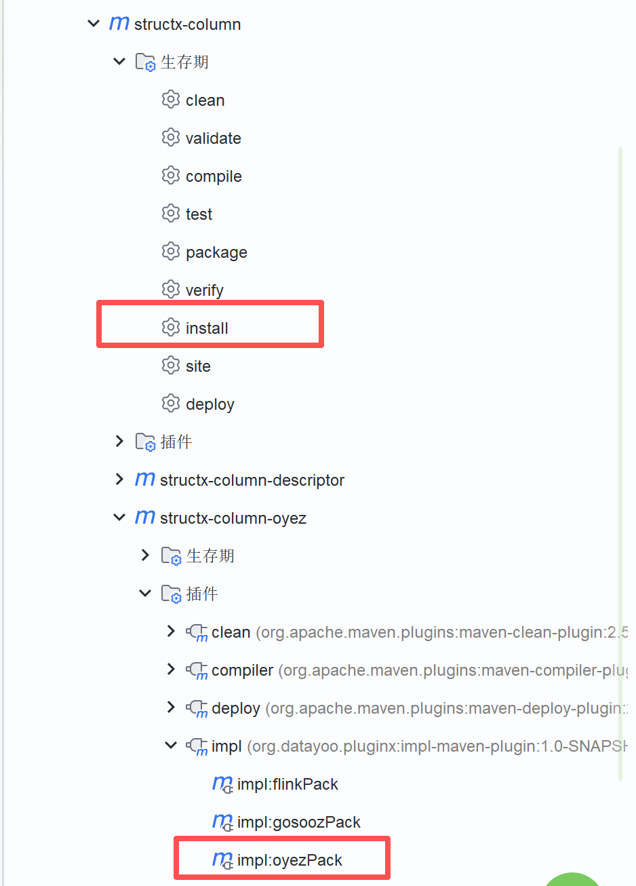
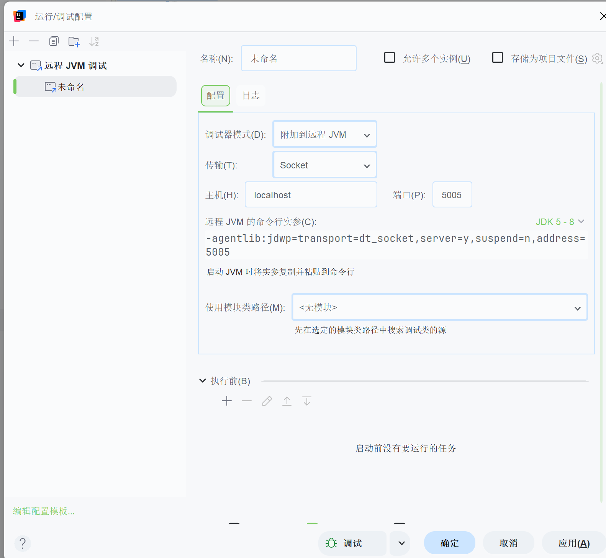

# datayoo-ops

[中文](README.md) | [English](README_EN.md)

HuggingFists 平台算子开源工程。将 HuggingFists 低代码数据平台的算子组件以 **Descriptor + Oyez** 的 SPI 架构逐步开放：每个算子由描述符（Descriptor）定义元数据与参数，由执行器（Oyez）提供运行时实现。

> **算子开发**：若要新建 / 定制算子，请前往脚手架与开发套件仓库 → [Datayoo/datayoo-ops-kit](https://github.com/Datayoo/datayoo-ops-kit)

## 目录

- [快速开始](#快速开始)
- [环境说明](#环境说明)
- [模块说明](#模块说明)
- [算子打包](#算子打包)
- [算子导入](#算子导入)
- [测试](#测试)

---

## 快速开始

`install/lib/` 目录存放平台私有依赖（Footstone、Sengee、Oyez、算子打包插件等），中央仓库没有。**本地编译前请先将它们安装到你实际使用的 Maven 本地仓库**，否则工程无法解析这些坐标。安装脚本与依赖同在 `install/` 下。

仓库路径需显式指定（命令行参数或 `MAVEN_REPO` 环境变量）；不传参数时脚本会交互提示输入。

> **提示**：IDEA 可在 `Settings → Build Tools → Maven → Local repository` 单独指定仓库。请将该路径传给安装脚本；若还需用命令行 Maven 构建，再按需安装到命令行 Maven 使用的仓库。

```bash
# Windows CMD（推荐）
install\install-lib.bat C:\path\to\repository
install\install-lib.bat C:\path\to\repository --force

# Windows PowerShell
.\install\install-lib.ps1 -Repo C:\path\to\repository
.\install\install-lib.ps1 -Repo C:\path\to\repository -Force

# Linux / macOS / Git Bash
./install/install-lib.sh /path/to/maven/repo
./install/install-lib.sh /path/to/maven/repo --force
export MAVEN_REPO=/path/to/maven/repo && ./install/install-lib.sh
```

路径写法注意：

- Git Bash 下 Windows 盘符使用正斜杠，例如 `D:/path/to/repository`
- CMD / PowerShell 使用反斜杠，例如 `D:\path\to\repository`

---

## 环境说明

编译与打包均需使用 **JDK 1.8**，不要用更高版本的 JDK 跑 Maven。

| 项 | 要求 |
|----|------|
| JDK | **1.8**（Java 8） |
| Maven | 使用上述 JDK 1.8；`source` / `target` = `1.8` |

可用 `java -version`、`mvn -v` 确认 Maven 实际绑定的是 1.8。

---

## 模块说明

后续会陆续开放更多算子源码。

```
ops-structx/
├── structx-column/               # 列级算子
│   ├── structx-column-descriptor
│   └── structx-column-oyez
├── structx-row/                  # 行级 / 结构转换算子
│   ├── structx-row-descriptor
│   └── structx-row-oyez
└── structx-processing/           # 数据处理算子
    ├── processing-row/           # 行集处理
    ├── processing-stream/        # 流式处理
    ├── processing-v/             # 列值处理
    └── processing-generator/     # 数据生成
```

### 模块结构

每个算子模块按 `descriptor` + `oyez` 两层组织：

| 层次 | 说明 |
|------|------|
| **Descriptor** | 算子元数据定义层。声明算子名称、版本、输入/输出端口、参数 schema 等，运行在 `sengee` 框架上。`src/main/resources` 下包含三类资源：`helps/`（算子帮助文档 `.md`）、`i18ns/`（国际化文案 `.json`）、`portraits/`（算子图标 `.svg`） |
| **Oyez** | 算子运行时实现层。实现算子的实际数据处理逻辑，运行在 `oyez` 运行时引擎上。`src/main/resources` 下可按需放置运行时配置文件（如 Tika 配置等） |

---

## 算子打包

descriptor 与 oyez 的打包插件（`descriptor-plugin` / `impl-plugin`）均依赖同模块的 `target/*.jar`，**需先编译**。

### 打包 Descriptor

在 IDEA 右侧 Maven 面板中：

1. 对目标 descriptor 模块先执行 `package`
2. 双击 `Plugins` → `descriptor-plugin` → `descriptorPack`，生成 descriptor zip

| 步骤示意 | |
|:---:|:---:|
|  |  |

### 打包 Oyez

oyez 模块可能依赖对应 descriptor 中的常量或方法。若存在依赖，请先将父级 module `install` 到本地，再打包：

1. 对目标 oyez 模块先执行 `package`
2. 双击 `Plugins` → `impl-plugin` → `oyezPack`，生成对应 zip

| 步骤示意 | |
|:---:|:---:|
|  |  |

---

## 算子导入

在 HuggingFists 平台中：

1. 打开 **资源库 → 算子库 → 导入**
2. 选择打包生成的 zip 文件即可完成导入


---

## 测试

1. 在 HuggingFists 平台 **流程 → 新增**，创建新流程
2. 用刚导入的算子搭建流程
3. 在 IDEA 中创建远程调试

默认远程调试端口：

| 目标 | 端口 |
|------|------|
| 定义态 | `38502` |
| oyez 计算节点 | `38505` |



---

> 本项目逐步开源中，更多算子模块将持续加入。新建算子请使用 [datayoo-ops-kit](https://github.com/Datayoo/datayoo-ops-kit)。
