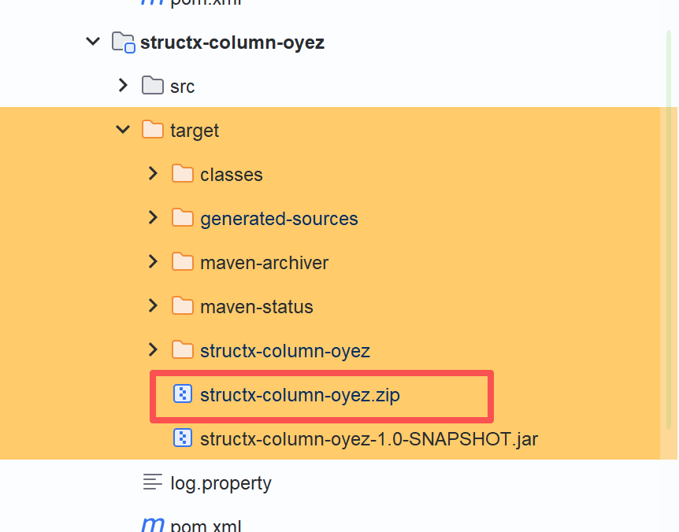
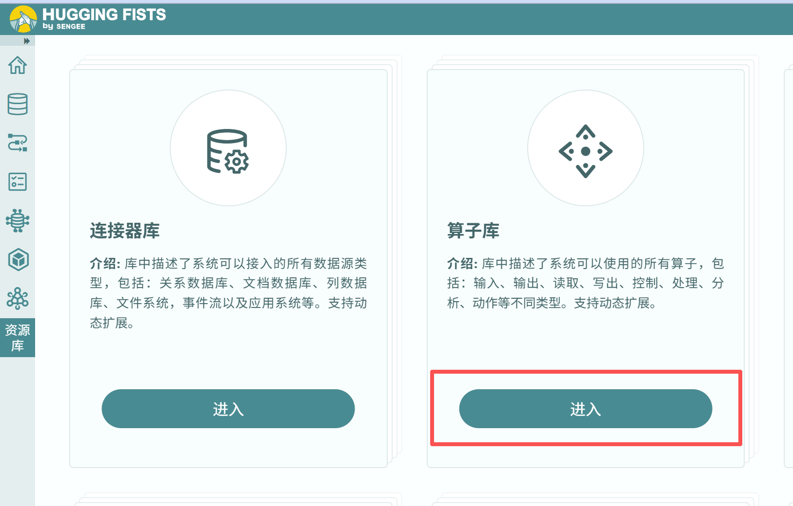

# datayoo-ops

[中文](README.md) | English

Open-source HuggingFists operators. Platform operators are being released gradually under a **Descriptor + Oyez** SPI architecture: each operator’s metadata and parameters are defined by a Descriptor, and its runtime logic is provided by an Oyez executor.

> **Operator development**: to create or customize operators, use the scaffold / kit → [Datayoo/datayoo-ops-kit](https://github.com/Datayoo/datayoo-ops-kit)

## Contents

- [Quick start](#quick-start)
- [Environment](#environment)
- [Modules](#modules)
- [Packaging](#packaging)
- [Import](#import)
- [Testing](#testing)

---

## Quick start

The `lib/` directory holds private platform dependencies (Footstone, Sengee, Oyez, operator packaging plugins, etc.) that are not on Maven Central. **Install them into the Maven local repository you actually use before building locally**, or the project cannot resolve those coordinates.

You must specify the repository path explicitly (CLI argument or `MAVEN_REPO`). If omitted, the script prompts interactively.

> **Tip**: IntelliJ IDEA can set a separate local repository under `Settings → Build Tools → Maven → Local repository`. Pass that path to the install script. If you also build with command-line Maven, install into that repository as needed.

```bash
# Windows CMD (recommended)
install-lib.bat C:\path\to\repository
install-lib.bat C:\path\to\repository --force

# Windows PowerShell
.\install-lib.ps1 -Repo C:\path\to\repository
.\install-lib.ps1 -Repo C:\path\to\repository -Force

# Linux / macOS / Git Bash
./install-lib.sh /path/to/maven/repo
./install-lib.sh /path/to/maven/repo --force
export MAVEN_REPO=/path/to/maven/repo && ./install-lib.sh
```

Path notes:

- In Git Bash on Windows, use forward slashes, e.g. `D:/path/to/repository`
- In CMD / PowerShell, use backslashes, e.g. `D:\path\to\repository`

---

## Environment

Build and packaging must use **JDK 1.8**. Do not run Maven with a newer JDK.

| Item | Requirement |
|------|-------------|
| JDK | **1.8** (Java 8) |
| Maven | Bound to JDK 1.8 above; `source` / `target` = `1.8` |

Confirm with `java -version` and `mvn -v` that Maven is using 1.8.

---

## Modules

More operator source will be opened over time.

```
ops-structx/
├── structx-column/               # column-level operators
│   ├── structx-column-descriptor
│   └── structx-column-oyez
├── structx-row/                  # row / structure-transform operators
│   ├── structx-row-descriptor
│   └── structx-row-oyez
└── structx-processing/           # data-processing operators
    ├── processing-row/           # row-set processing
    ├── processing-stream/        # stream processing
    ├── processing-v/             # column-value processing
    └── processing-generator/     # data generation
```

### Module layout

Each operator module is organized as `descriptor` + `oyez`:

| Layer | Description |
|-------|-------------|
| **Descriptor** | Metadata layer. Declares name, version, I/O ports, parameter schema, etc., on the `sengee` framework. Under `src/main/resources`: `helps/` (help docs `.md`), `i18ns/` (i18n `.json`), `portraits/` (icons `.svg`) |
| **Oyez** | Runtime implementation. Executes the operator’s data logic on the `oyez` engine. Optional runtime configs may live under `src/main/resources` (e.g. Tika) |

---

## Packaging

The descriptor and oyez packaging plugins (`descriptor-plugin` / `impl-plugin`) both depend on the module’s `target/*.jar` — **compile first**.

### Package Descriptor

In the IntelliJ Maven tool window:

1. Run `package` on the target descriptor module
2. Double-click `Plugins` → `descriptor-plugin` → `descriptorPack` to produce the descriptor zip

| Steps | |
|:---:|:---:|
|  |  |

### Package Oyez

An oyez module may depend on constants or methods from its descriptor. If so, `install` the parent module locally first, then package:

1. Run `package` on the target oyez module
2. Double-click `Plugins` → `impl-plugin` → `oyezPack` to produce the zip

| Steps | |
|:---:|:---:|
|  |  |

---

## Import

In HuggingFists:

1. Open **Resource Library → Operator Library → Import**
2. Select the packaged zip files to import



---

## Testing

1. In HuggingFists, open **Flow → New** and create a flow
2. Build the flow with the newly imported operators
3. Create a remote debug configuration in IntelliJ IDEA

Default remote debug ports:

| Target | Port |
|--------|------|
| Definition runtime | `38502` |
| oyez compute node | `38505` |


---

> This project is being open-sourced gradually; more operator modules will follow. To create new operators, use [datayoo-ops-kit](https://github.com/Datayoo/datayoo-ops-kit).
